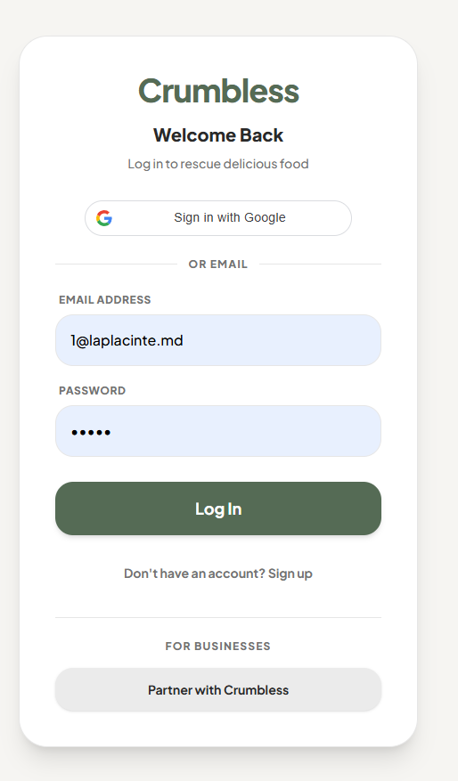
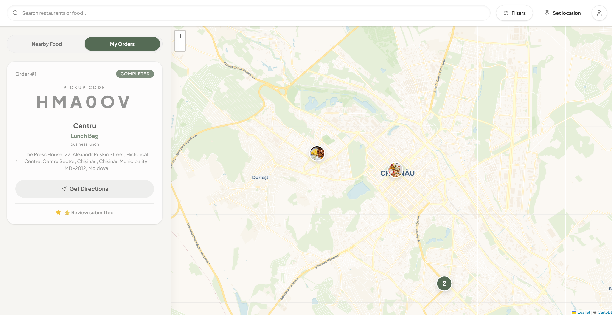
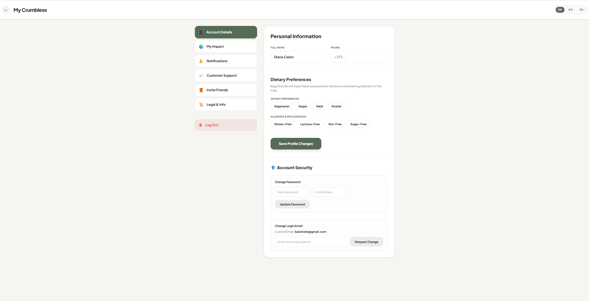
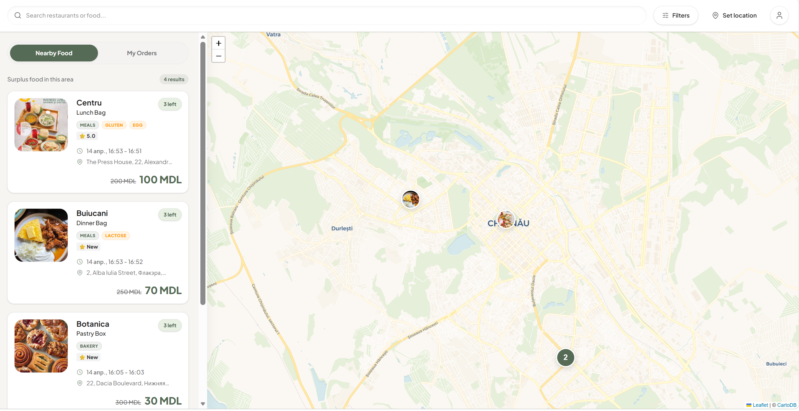
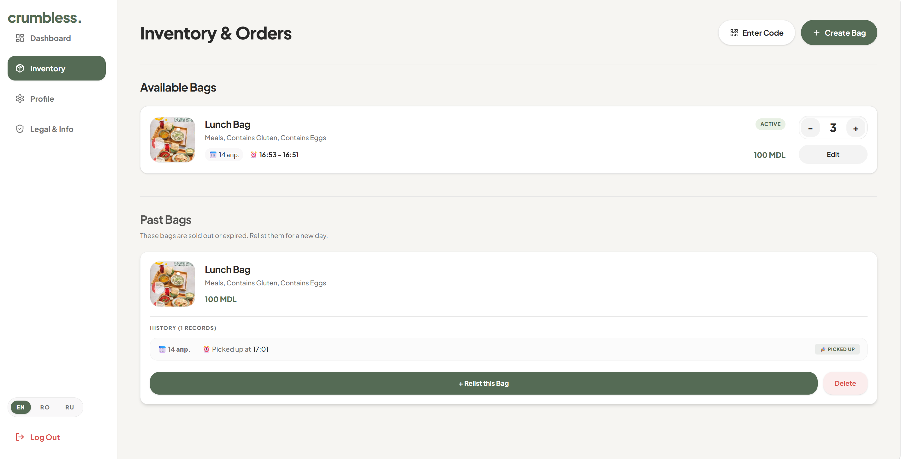
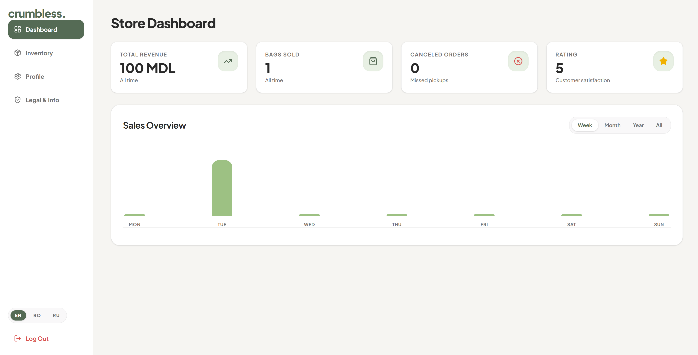
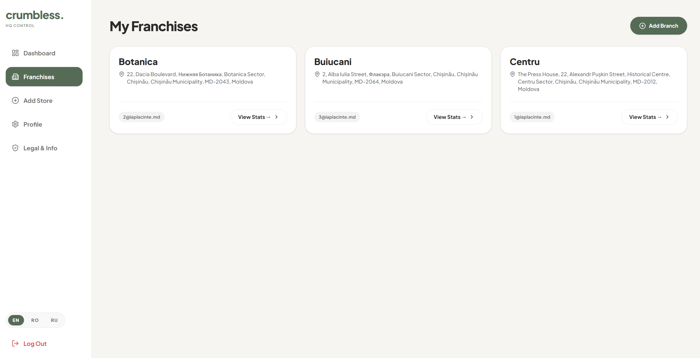

# 🌿 Crumbless

[](https://reactjs.org/)
[](https://fastapi.tiangolo.com/)
[](https://stripe.com/)
[](https://tailwindcss.com/)

**Crumbless** is an enterprise-grade food waste recovery platform. We connect restaurants, bakeries, and grocery stores with environmentally-conscious consumers to rescue surplus food at the end of the day via heavily discounted "Surprise Bags."

By bridging the gap between local businesses and consumers, Crumbless helps businesses recover sunk costs, allows users to eat well for less, and significantly reduces the carbon footprint associated with food waste.

---

## 📸 Sneak Peek

### The Consumer Experience
<div align="center">
  
  
</div>
*Interactive map discovery, strict pickup window logic, dietary warnings, and Stripe checkout.*

### The User Profile & Environmental Impact
<div align="center">
  
  
</div>
*Granular dietary/allergy profile management and real-time calculation of saved money, meals, and CO₂.*

### The Store Manager Portal
<div align="center">
  
  
</div>
*Full inventory control, revenue analytics, cancelation tracking, and customer reviews.*

### The Enterprise HQ & Fleet Deployment
<div align="center">
  
</div>
*Global franchise data aggregation and instant geocoding-based branch deployment.*

---

## ✨ Key Features

The platform is divided into three distinct operational domains:

### 1. Client App (Consumers)
* **Geospatial Discovery:** Browse nearby surplus food using an interactive map powered by Leaflet and PostGIS.
* **Smart Filtering:** Filter by dietary preferences (Vegan, Vegetarian), allergens, and pickup times.
* **Safety Shields:** Visual warnings if a selected bag violates saved user dietary profiles.
* **Secure Checkout:** Fully integrated Stripe payment flow with automated temporary reservations.
* **Impact Tracking:** Real-time dashboards calculating money saved, meals rescued, and CO₂ prevented.

### 2. Store Portal (Branch Managers)
* **Inventory Control:** Create, edit, relist, and delete daily Surprise Bags.
* **Secure Fulfillment:** Verify customer pickups using a secure 6-digit alphanumeric code.
* **Automated Timelines:** Bags automatically expire and move to "Past Bags" if unpicked by the end of the window.
* **Local Metrics:** Track branch-specific revenue, cancelation rates, and customer reviews.

### 3. HQ Portal (Parent Companies)
* **Global Analytics:** Aggregate revenue, volume, and rating metrics across all franchise locations.
* **Fleet Management:** Deploy new store locations instantly using a built-in geocoding map tool.
* **Drill-Down Auditing:** Read-only access to inspect individual store inventory and active reservations.

---

## 🛠️ Tech Stack

### Frontend (Feature-Sliced Architecture)
* **React 19** + **Vite** for lightning-fast HMR and optimized builds.
* **React Router v7** for complex nested routing and protected routes.
* **Tailwind CSS v4** for utility-first, responsive, and highly customized styling.
* **React-Leaflet** for interactive mapping and spatial visualization.

### Backend (Modular API)
* **Python 3.10+** & **FastAPI** for high-performance asynchronous API endpoints.
* **SQLAlchemy** (ORM) & **SQLite/PostgreSQL** for relational data management.
* **GeoAlchemy2** for complex spatial queries (`ST_DWithin`, `ST_Intersects`).
* **PyJWT** & **Passlib** for secure Role-Based Access Control (RBAC).
* **Stripe Python SDK** for financial transactions.

---

## 🚀 Installation & Local Setup

### Prerequisites
* Node.js (v18+)
* Python (v3.10+)

### 1. Backend Setup
Navigate to the backend directory, create a virtual environment, and install dependencies:
```bash
cd backend
python -m venv venv

# On Windows:
venv\Scripts\activate
# On Mac/Linux:
source venv/bin/activate

pip install -r requirements.txt
```

**Environment Variables:**
Create a `.env` file in the `backend/` folder:
```env
STRIPE_SECRET_KEY=sk_test_your_key_here
SECRET_KEY=your_secure_jwt_secret
```

**Run the Server:**
```bash
uvicorn main:app --reload
```
*The API will be running at `http://127.0.0.1:8000`*

### 2. Frontend Setup
Open a new terminal, navigate to the frontend directory, and install dependencies:
```bash
cd frontend
npm install
```

**Environment Variables:**
Create a `.env` file in the `frontend/` folder:
```env
VITE_API_URL=[http://127.0.0.1:8000](http://127.0.0.1:8000)
```

**Run the Development Server:**
```bash
npm run dev
```
*The app will be running at `http://localhost:5173`*

---

## 🏗️ Architecture

Crumbless uses a scalable, feature-sliced architecture to keep the codebase clean and maintainable:

```text
crumbless/
│
├── backend/                  # FastAPI Application
│   ├── main.py               # App initialization & router mounting
│   ├── dependencies.py       # Auth guards, database yields & chron-jobs
│   ├── models.py             # SQLAlchemy schemas & table definitions
│   ├── schemas.py            # Pydantic validation models
│   ├── auth.py               # JWT and password hashing logic
│   └── routers/              # Modular API endpoints
│       ├── auth_router.py    
│       ├── client_router.py  
│       ├── store_router.py   
│       ├── hq_router.py      
│       └── order_router.py   
│
└── frontend/                 # React + Vite Application
    ├── src/
    │   ├── api.js            # Axios instance with auth interceptors
    │   ├── components/       # Global UI (Buttons, StatCards, Charts)
    │   ├── features/auth/    # Login & Registration flows
    │   ├── client/           # Consumer facing map, details, checkout
    │   ├── store/            # Branch manager inventory dashboards
    │   └── hq/               # Enterprise analytics and deployment
```

---

## 🗺️ Roadmap (Coming Soon)
- [ ] **Identity Verification:** Email and SMS OTP verification using SendGrid/Twilio.
- [ ] **Real-time Notifications:** WebSocket integration for instant order updates.
- [ ] **Telegram Support Bot:** Two-way customer support chat routed through Telegram.
- [ ] **Mobile Deployment:** Native iOS and Android wrapping using Ionic Capacitor.

---

## 📄 License
This project is proprietary and confidential. All rights reserved.
```
